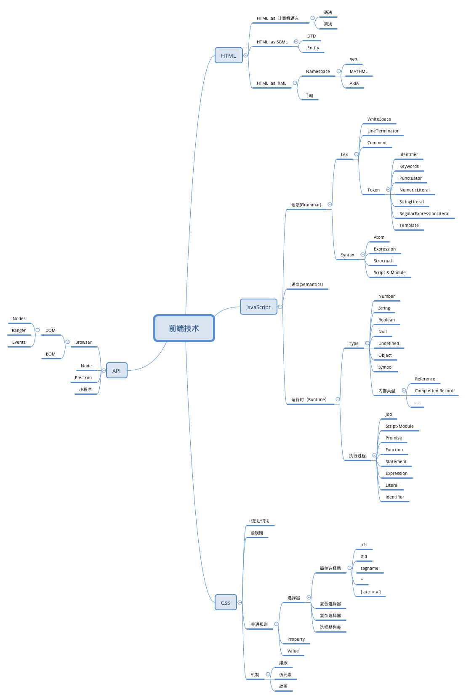

### 前端知识体系脑图

### 1. 如何建立自己的知识体系？

如果知识没有体系，零散杂乱，是很难在遇到问题时快速找到有效的解决方法的，也很难提高自己现有的技术水平
因此需要学会用有效的方法建立自己的知识体系

- 整理法，即按照知识的门类特点进行梳理，构建
- 回溯法，即追溯知识点的来龙去脉，通过相关历史节点进行梳理

### 2. 如何建立知识体系的模型？

构建知识体系的目的是为了解决问题，那么解决问题就需要方式和手段，比如：编程能力、架构能力、工程能力，而在这个基础知识之上是基本的前端能力。这些都是纯技术的东西，真正的技术需要落地你还需要某个行业的 领域知识，比如零售、餐饮、物流等等。

其实还是需要自己建立更好的学习手段，在学习的过程中进行知识的再消化与分类总结等。

### 3. 如何有效的提升自己？

通过量化的方式，形成数据驱动自己前进的模式。
比如先摸清自己的定位，现状，根据这些给自己定目标，之后分析目标，做有效规划，之后实施，根据结果在进行反思总结。
实施最好从简单的，容易的，方便推动的开始尝试，快速建立反应链。

